This document contains notes and additional readings for self-study.

## Lecture 4: Computer Vision

- Misc.
  - On cross-entropy
    - [(Wiki page) Cross Entropy](https://en.wikipedia.org/wiki/Cross_entropy)
    - [A Gentle Introduction to Cross-Entropy for Machine Learning](https://machinelearningmastery.com/cross-entropy-for-machine-learning/)
    - [Liangjie Hong: Notes on Logistic Loss Function](http://www.hongliangjie.com/wp-content/uploads/2011/10/logistic.pdf)
- Classification
  - Image augmentation
  - Use pre-trained models for fine tuning and transfer learning
  - Large networks trained for classification are heavily re-used for object detection and semantic segmentation tasks.
- Object Detection
  - YOLO for object detection
    - [EPFL EE-559, 8-3: Object Detection](https://fleuret.org/ee559/materials/ee559-slides-8-3-object-detection.pdf)
  - R-CNN
    - [Dive into Deep Learning - 13.8. Region-based CNNs (R-CNNs)](https://d2l.ai/chapter_computer-vision/rcnn.html)
  - Takeaways
    - One-stage detectors (YOLO, SSD, RetinaNet, etc) are *fast* for inference *not as accurate*.
    - Two-stage detectors (Fast R-CNN, Faster R-CNN, R-FCN, Light head R-CNN, etc) are usually *slower* but are *more accurate*.
    - Both depend on engineering decisions.
- Segmentation
    - Task: partitioning an image into regions of different semantic categories at *pixel level*. 
    - Fully convolutional network(FCN) and transposed convolution
      - [CS231n, Lecture 11, 2018.](http://cs231n.stanford.edu/slides/2018/cs231n_2018_lecture11.pdf)
    - Mask R-CNN
      - Object detection combined with mask prediction enables instance segmentation.
      - [Dive into Deep Learning - 13.8.4 Mask R-CNN](https://d2l.ai/chapter_computer-vision/rcnn.html)

## Lecture 5: Training Neural Networks
  - Gradient descent
    - GD, SGD, mini-batch SGD
    - Rely on assumptions on 1) the magnitude of the local curvature to set the step size, and 2) *isotropy* in gradient so the step size makes sense in all directions
  - [Wolfe conditions](https://glouppe.github.io/info8010-deep-learning/?p=lecture5.md#18) ensures that both the loss function decreases sufficiently and the slope reduces sufficiently. However, line search will be too expensive for DL, and might lead to local minimum / overfitted solution.
  - [Momentem](https://glouppe.github.io/info8010-deep-learning/?p=lecture5.md#25)
    - Use momentum to add inertia in the choice of the step direction
    - [Nesterov momentem](https://glouppe.github.io/info8010-deep-learning/?p=lecture5.md#28)
  - Adaptive learning rate: without the assumption of istropic gradient
    - Per-parameter methods: [AdaGrad](https://glouppe.github.io/info8010-deep-learning/?p=lecture5.md#31), [RMSProp](https://glouppe.github.io/info8010-deep-learning/?p=lecture5.md#32), [Adam](https://glouppe.github.io/info8010-deep-learning/?p=lecture5.md#33)
    - [Scheduling](https://glouppe.github.io/info8010-deep-learning/?p=lecture5.md#36)
  - Some additional reading on optimization: [(Sebastian Ruder) An overview of gradient descent optimization algorithms](https://ruder.io/optimizing-gradient-descent/)
- Initialization
  - Principles
    - Break symmetry
    - Control variance of activation across layers during forward and backward pass
  - Xavier initialization
- Normalization
  - Batch normalization
  - Layer normalization

## Lecture 6: Recurrent Neural Networks
- Some of the notes were added by reviewing [EPFL EE-559, 12.1 – Recurrent Neural Networks](https://fleuret.org/ee559/materials/ee559-slides-12-1-RNN-basics.pdf), [12.2 LSTM and GRU](https://fleuret.org/ee559/materials/ee559-slides-12-2-LSTM-and-GRU.pdf)
- Types of tasks
  - Classification: sequence to classes
  - Synthesis: real values to sequence
  - Translation: sequence to sequence
- Temporal convolutions
- Recurent neural networks
  - Structure
    - maintain a recurrent state updated at each time step (a function of state the previous step, input of the current step, and weights), $\mathbf{h}_t = \phi (\mathbf{x}_t, \mathbf{h}_{t-1}; \theta)$. So if $\mathbf{x} \in \mathbb{R}^D and h \in \mathbb{R}^Q$, then $\phi:\mathbb{R}^D \times \mathbb{R}^Q \rightarrow \mathbb{R}^Q$
    - Predictions can be computed at any step from the recurrent state $y_t = \psi(\mathbf{h}_t;\theta)$.
    
      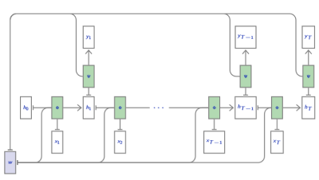
    
    - Elman netoworks apply non-linear activation functions as $\phi$ and $\psi$
    $$h_t=\text{ReLU}(W_{x(\times h)}\mathbf{X}_t + W_{(h \times h)}h_{t-1} + b_{(h)}), \quad y_{T}=W_{(h\times y)}h_T + b_{(y)}$$
  - **Stacked RNN** 
    - Since RNNs can be viewed as layers producing sequences of activations, and can be stacked
  - **Bidirectional RNNs**. RNNs can be made *bidirectional*. run the same single direction RNN twice from both end and concatenate the states.
  - Gating
    - Similar to the skip connections in ResNet, RNN cells can inlude pass-throughs so recurrent state does not go repeatedly through a squashing non-linearity.
    - [*forget gate*](https://glouppe.github.io/info8010-deep-learning/?p=lecture6.md#27): current state update be a per-component weighted average of its previous value and a full update, with the weighting depending on input and the previous state.
    
    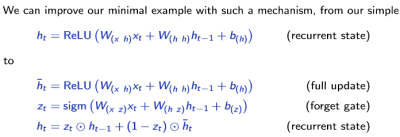
  
  - LSTM is able to learn long-term dependencies, and the core idea is to use cell state and erase/update/output gates for cell state information.
    - See [Understanding LSTM Networks](https://colah.github.io/posts/2015-08-Understanding-LSTMs/) by Colah
    - Mathematical formulation of a LSTM cell 

    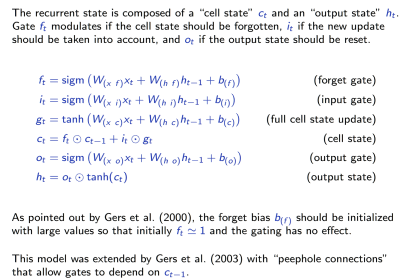

    - A visualization of a (two-layer) LSTM

    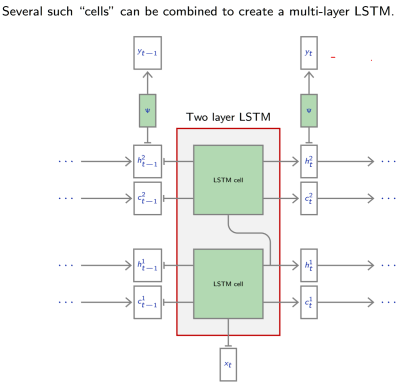

  - GRU (gated recurren unit) uses two (instead of three as in LSTM) gates (update/reset), and it performs similarly to LSTM but with fewer parameters (although LSTM is strictly stronger).
    - Mathematical formuation of a GRU cell
    
    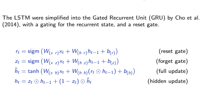
  
  - Graident
    - Note that gated units prevent gradients from vanishing, but not from exploding, which can be solved using **gradient norm clipping** (scaling of the norm).
    $$\tilde{\triangledown f} = \dfrac{\triangledown f}{||\triangledown f||}\min(||\triangledown f||, \delta)$$
    - Orthogonal initialization (of the weight matrix) will guarantee that activations will neigher vanish nore explode.
- Applications
  - Sentiment analysis
    - Document-level modeling for sentiment analysis (= text classification),
with stacked, bidirectional and gated recurrent networks. ([Duyu Tang et al, 2015](https://www.aclweb.org/anthology/D15-1167/))
  - Language models
    - Language as Markov Chain $p(\mathbf{w}_t|\mathbf{w}_{1:t-1})$
    - An instance of sequence synthesis where predictions are computed at all time steps
    - Text generation ([Max Woolf 2018](https://drive.google.com/file/d/1mMKGnVxirJnqDViH7BDJxFqWrsXlPSoK/view))
  - Sequence synthesis
  - Neural machine translation ([Google's Neural Machine Translation System: Bridging the Gap between Human and Machine Translation](https://arxiv.org/abs/1609.08144))
  - Text-to-speech synthesis
- Beyond sequences
  - Neural computers
  - Programs as neural nets
  - Graph neural network
- Reference
  - [Kyunghyun Cho, "Natural Language Understanding with Distributed Representation", 2015](https://arxiv.org/pdf/1511.07916.pdf)

## Lecture 7: Auto-encoders and generative models
  - An **auto-encoder** is a composite function made of
    - *encoder* $f$ from the original space $\mathcal{X}$ to a latent space $\mathcal{Z}$
    - *decoder* $g$ to map back to $\mathcal{X}$
    - such that $g \circ f$ is close to the identity on the data, i.e. $\mathbb{E}_{\mathbf{x}\sim p(\mathbf{x})}[||\mathbf{x}-g\circ f(\mathbf{x})||^2]\approx 0$
    - Training an auto-encoder consists of minimizing this loss function to find the best parameterization of $f$ and $g$.
  - Interpolation on latent space can be made to get an intuition of the learned latent representation.
  - Denoising auto-encoders
    - The goal is to optimize $h=g\circ f: \mathcal{X} \rightarrow \mathcal{X}$ such that a perturbation $\tilde{\mathbf{x}}$ is restored to $\mathbf{x}$.
    - A weakness of denoising auto-encoder is that the posterior $p(\mathbf{x}|\tilde{\mathbf{x}})$ may be multi-modal.
- Generative models
  - a probabilistic model that can be used to simulate the data, $\mathbf{x} \sim p(\mathbf{x};\theta)$.
  - Applications
    - Supper-resolution, Compression, text-to-speech
    - Proteomics, drug discovery, astronomy
    - Planning, exploration, model-based RL
  - The decoder $g$ can be assessed by introducing a density model $q$ over the latent space $\mathcal{Z}$ for sampling and mapping back into the data space $\mathcal{X}$. (e.g., Gaussian $q(\mathbf{z}) = \mathcal{N}(\hat{\mu}, \hat{\Sigma})$)
  - Sampled and generated results are not satisfactory because the density model $p$ on the latent space is too simple and inadequate.
- Variational inference (VI)
  - A prescribed latent variable model that defines a joint probability $p(\mathbf{x}, \mathbf{z}) = p(\mathbf{x} | \mathbf{z})p(\mathbf{z})$
  - Bayes rule gives $p(\mathbf{z}| \mathbf{x}) = \dfrac{p(\mathbf{x} | \mathbf{z})p(\mathbf{z})}{p(\mathbf{x})}$, which is intractable for integrating over $\mathbf{x}$.
  - VI turns the posterior inference into an optimization problem that minimize the KL divergence between $p(\mathbf{z}|\mathbf{x})$ and the approximation $q(\mathbf{z}|\mathbf{x};\nu)$
    - See slides [pp. 44](https://glouppe.github.io/info8010-deep-learning/?p=lecture7.md#44) - [pp.47](https://glouppe.github.io/info8010-deep-learning/?p=lecture7.md#47) for details of the KL divergence, *evidence lower bound objective* (ELBO), and the optimization setups.
    - ELBO encourages distributions to place their mass on configurations of latent variables that explain the oberved data, and close to the prior.
- Variational auto-encoders
  - Variational auto-encoder is a deep latent model where 
    - $p(\mathbf{x}|\mathbf{z};\theta)$ is parameterized with a **generative network** $\text{NN}_\theta$ (decoder) that takes input $\mathbf{z} \in \mathcal{Z}$ and outputs parameters $\phi=\text{NN}_\theta (\mathbf{z})$ to the data distribution, i.e.
    
    $$\mu, \sigma = \text{NN}_\theta(\mathbf{z}), \quad p(\mathbf{x}|\mathbf{z};\theta)=\mathcal{N}(\mathbf{x};\mu, \sigma^2\mathbf{I})$$
    
    - The approximate posterior $q(\mathbf{z}|\mathbf{x};\varphi)$ is parameterized with an **inference network** $\text{NN}_\varphi$ (encoder) that takes as input $\mathbf{x}$ and outputs parameters $\nu=\text{NN}_\varphi(x)$ to the approximate posterior. E.g.
    $$\mu, \sigma = \text{NN}_\varphi(\mathbf{x}), \quad q(\mathbf{z}|\mathbf{x};\varphi) = \mathcal{N}(\mathbf{z};\mu,\sigma^2\mathbf{I})$$
  - We use variational inference to jointly optimize the generative and inference networks. 
    - Doing so involves Monte Carlo integration (for computing gradients of the ELBO w.r.t. $\theta$) and reparameterization trick + Monte Carlo (for computing gradients of ELBO w.r.t. $\varphi$)

## Lecture 8: Generative Adversarial Networks

- Generative adversarial networks (GANs)
  - Two-player game
    - Generator network $g(\cdot;\theta):\mathcal{Z}\rightarrow\mathcal{X}$ with prior $p(\mathbf{z})$ on latent space, thereby inducing a generative distribution

    $$\mathbf{x} \sim q(\mathbf{x};\theta) \iff \mathbf{z} \sim p(\mathbf{z}), \mathbf{x}=g(\mathbf{z};\theta)$$

    - Discriminative network $d(\cdot;\phi):\mathcal{X}\rightarrow[0, 1]$ as a classifier to distinguish between true samples $\mathbf{x}\sim p(\mathbf{x})$ and generated samples $\mathbf{x}\sim q(\mathbf{x};\theta)$
  - Objective of GANs
    - Use cross-entropy loss for $d$ and we have the *value function* (log-likelihood)
    $$V(\phi, \theta) =\mathbb{E}_{\mathbf{x}\sim p(\mathbf{x})}[\log d(\mathbf{x};\theta)] + \mathbb{E}_{\mathbf{z}\sim p(\mathbf{z})}[1-d(g(\mathbf{z};\theta);\phi))]$$
    - The ultimate goal is $\theta^*=\arg \min_{\theta} \max_{\phi} V(\phi, \theta)$
    - Mathematically $\theta^*$ is minimum $\iff$ $p(\mathbf{x}) = q(\mathbf{x};\theta)$, that is, the corresponding generative model can perfectly reproduce the true data distribution.
  - Learning process
    - Alternating SGD
      $$\theta \leftarrow \theta - \gamma \nabla_{\theta}V(\phi, \theta); \quad \phi \leftarrow \phi - \gamma \nabla_{\phi}V(\theta, \phi)$$
    - For each step of $\theta$ we can take $k$ steps on $\phi$ to make the classifier near optimal
    - Computing $\nabla_{\theta}$ requres backprop through $d$ before computing the partial derivatives w.r.t. $g$'s internals.
  - Open problems
    - Training standard GAN often results in pathological behaviors due to
      - Oscillations without convergence
      - Vanishing gradients
      - Mode collapse: $g$ models well on a small sub-population concentrating on a few modes of the data distribution.
      - Performance diffucult to assess in practice. 
- Wasserstein GANs
  - Original GAN as defined above suffers from vanishing gradients, especially when initialy $\mathbf{x} \sim q(\mathbf{x};\theta)$ can be so bad that the response of $d$ saturates, meaning $d$ is nearly perfect there fore $V(\phi, \theta) = ... (defined above)$ has near-zero gradients which halts the optimization.
    - One of the reason for the setback is that Jensen-SHannon divergence poorly accounts for the metric structure of the space.
  - Wasserstein GAN uses Wasserstein-1 distance
  $$\theta^* = \arg \min_{\theta}W_1(p(\mathbf{x}||q(\mathbf{x};\theta)) \\ 
  =\arg\min_{\theta}\max_{\phi:||d(\cdot;\phi)||_{L}\leq 1}\mathbb{E}_{\mathbf{x}\sim p(\mathbf{x})}[d(\cdot;\phi)] - \mathbb{E}_{\mathbf{x}\sim q(\mathbf{x};\theta)[d(\mathbf{x};\theta)]}$$
    - In this case, $d:\mathcal{X}\rightarrow\mathbb{R}$ is a critic function that satisfies 1-Lipschitzness.
    - See [Arjovsky et al (2017)](https://arxiv.org/pdf/1701.07875.pdf) and [Gulrajani et al (2017)](https://arxiv.org/pdf/1704.00028.pdf) for details.
  - As a result, Wasserstein GANS benefit from 
    - A meaningful loss metric
    - Improved stability (no mode collapse is observed)
- Convergence of GANs
  - TODO: this section (from pp. 39 - 54) is skipped for now, with some brief notes as follows:
    - GANs suffer from [saddle point](https://en.wikipedia.org/wiki/Saddle_point), see [Ferenc Huszár, GANs are Broken in More than One Way, 2017](https://www.inference.vc/my-notes-on-the-numerics-of-gans/) for details
    - The loss function of Vanilla GANs and Wisserstein GANs can be unified to analyse the convergence.
    - Reference: [Mescheder et al, 2018. Which Training Methods for GANs do actually Converge?](https://arxiv.org/pdf/1801.04406.pdf) 
- State of the art
  - Progress: Wasserstein GANs as baseline + Gradient Penalty ([Gulrajani 2017](https://arxiv.org/pdf/1704.00028.pdf)) + quite a few other tricks
  - BigGANs
    - [Brock et al, 2018: Large Scale GAN Training For High Fidelit Natural Image Synthes](https://arxiv.org/pdf/1809.11096.pdf)
  - StyleGAN
    - V1: [Karras et al, 2018](https://arxiv.org/pdf/1812.04948.pdf)
    - V2: [Karras et al, 2019](http://openaccess.thecvf.com/content_CVPR_2019/papers/Karras_A_Style-Based_Generator_Architecture_for_Generative_Adversarial_Networks_CVPR_2019_paper.pdf)
- Applications
  - The prior $p(\mathbf{z})$ of the latent space need not be a random noise distribution
  - Image-to-image translation: [CycleGANs (Zhu et al, 2017)](https://arxiv.org/pdf/1703.10593.pdf)
  - [Nvidia: Stroke of Genius: GauGAN Turns Doodles into Stunning, Photorealistic Landscapes](https://blogs.nvidia.com/blog/2019/03/18/gaugan-photorealistic-landscapes-nvidia-research/)
  - Captioning
  - Text-to-image synthesis
    - [Zhang et al, 2017: StackGAN: Text to Photo-realistic Image Synthesis with Stacked Generative Adversarial Networks](https://arxiv.org/pdf/1612.03242.pdf)
  - Music generation
    - [MuseGAN (Dong et al, 2018)](https://salu133445.github.io/musegan/pdf/musegan-aaai2018-paper.pdf)
  - Accelerating scientific simulators
    - [Learning particle physics (Paganini et al, 2017)](https://arxiv.org/pdf/1701.05927.pdf)
    - Learning cosmological models ([Rodriguez et al, 2018](https://arxiv.org/pdf/1801.09070.pdf))
    - Brain reading ([Shen et al, 2018](https://www.biorxiv.org/content/10.1101/272518v1))

## Supplementary Notes
This section contains reading notes for lecture 12 - 13 of the [EPFL EE-559 – Deep Learning](https://fleuret.org/ee559/) course as supplementary materials to the INFO8010 course.

### Recurrent models and NLP

- [12.3. Word embeddings and translation](https://fleuret.org/ee559/materials/ee559-slides-12-3-word-embeddings-and-translation.pdf)
  - Motivation: To devise a proper density model for sequence of words when vocabularies are usually of the order of $10^4 - 10^6$ words, a standard strategy is to embed words into a geometrical space and exploit regularities for further statistical modeling.
  - Continuous Bag of Words (CBOW, Mikolov et al., 2013a)
    - In this model, the embedding vectors are chosen so that a word can be[linearly] predicted from the sum of the embeddings of words around it.
    - Negative sampling on the correct class and randomly sample the incorrect classes.
  
    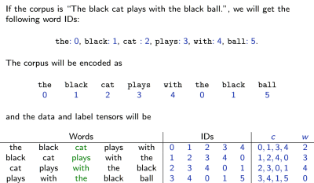
    
    - Uses (variant of) logistic loss
  - Skip-gram
    - Optimizes the embedding so that a word can be predicted by any individual word in its context.
  
    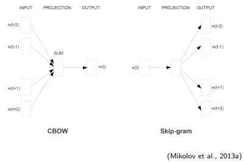
    
  - Sequence-to-sequence translation
    - Diagram
      
      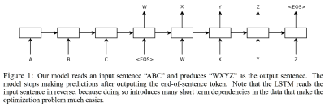
    - Evaluation standard: **BLEU** (bilingual evaluation understudy) score that counts the fraction of groups ofone, two, three and four words (aka “n-grams”) from the generated sentencethat appear in the reference translations.

### Attention models
  - [13.1 Attention Mechanisms](https://fleuret.org/ee559/materials/ee559-slides-13-1-attention.pdf)
    - On a high level, attention mechanisms aggregate features with an importance score that 
      - depends on the feature themselves, not only on their position in the tensor
      - relax locality constraints
    - In **spatial attention**, the contribution of input to aggregated information is driven by their location, as shown by an example of average pooling below:
      - With 1-D convolutional map $x \in \mathbb{R}^{T\times D}$, 
      - average pooling computes $y_j = \sum_{i=1}^T\dfrac{\mathbf{1}_{|j-i|\leq \triangle}}{\sum_k \mathbf{1}_{|j-i|\leq \triangle}}x_i$ 
    - **Context attention**
  
      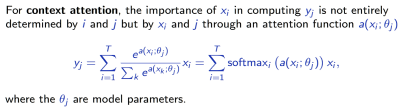
    
    - **Self-attention** is a special case of context attention, where the importance of $x_i$ in computing $y_j$ depends on $x_i$ and $x_j$
      - $y_j = \sum_{i=1}^T\text{softmax}_i(a(x_i,x_j;\theta))x_i$
    - The most standard approaches for attention function is dot-product, $a(x;V)=x^TV$, or $a(x,x';W,W')=(Wx)^T(W'x')$ for self-attention. However $a(\cdot)$ can take any form.
    - Attention for seq2seq
      - Recap of seq2seq

      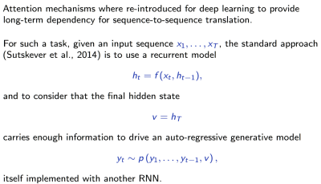

      - The main weakness of vanilla seq2seq is that all the information has to flow through a single state $v=h_T$, whose capacity has to accommodate any situation.
      - Attention mechanism adds channels to transport local information from the input sequence to the place where it is useful in the resulting sequence. 
      - The following diagram is based on [Bahdanau et al., 2014](https://arxiv.org/abs/1409.0473).

      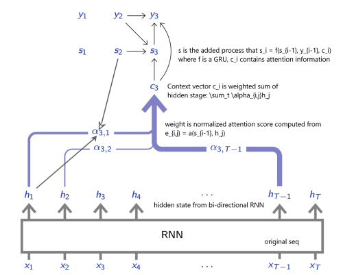 

## Resrouces
- [EPFL EE-559 – Deep Learning](https://fleuret.org/ee559/) - EE-559 "Deep Learning", taught by François Fleuret in the School of Engineering of the École Polytechnique Fédérale de Lausanne, Switzerland.
- [Dive into Deep Learning](https://d2l.ai/): An interactive deep learning book with code, math, and discussions, based on the NumPy interface.
- [Notes of deep learning specialization](https://github.com/mbadry1/DeepLearning.ai-Summary), good for reviewing the fundamentals of DL.